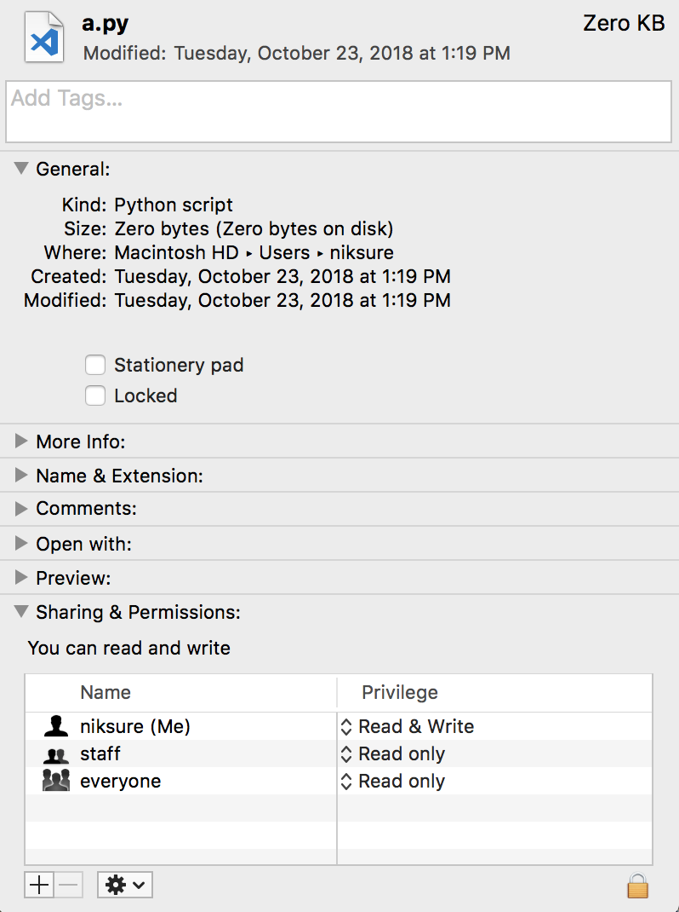
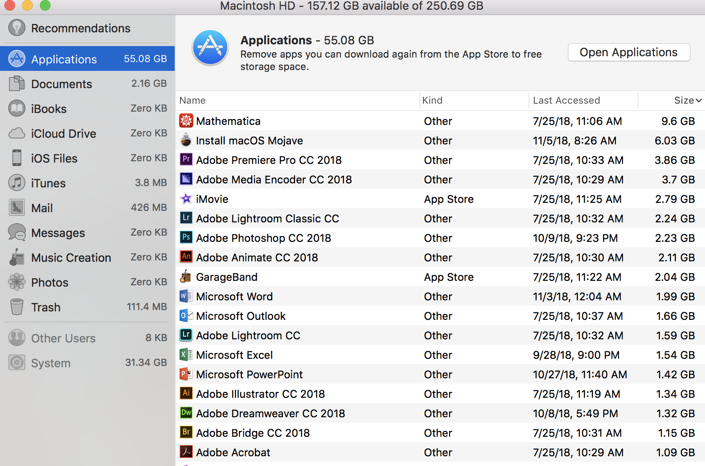

# Sudo Usage

What are some of the commands that have been run as sudo recently on your machine? Is there anything there that you don't recognize as something you did?

## Response

 Using the following command, I was able to find all of usage of commands run with superuser privledges (from https://apple.stackexchange.com/questions/272442/where-can-i-find-logs-for-failed-sudo-attempts-on-macos-sierra):

    log show --style syslog --predicate 'process == "sudo"' | grep COMMAND

I got the following results:

    2018-10-18 20:15:09.353210-0700  localhost sudo[7142]:  niksure : TTY=ttys000 ; PWD=/Users ; USER=root ; COMMAND=/usr/bin/find . -perm u=w
    2018-10-23 16:18:51.330054-0700  localhost sudo[30166]:     root : TTY=unknown ; PWD=/private/tmp/PKInstallSandbox.DBdmcu/Scripts/com.opendns.osx.RoamingClient.nhtNpW ; USER=niksure ; COMMAND=/bin/launchctl unload -S Aqua /Library/LaunchAgents/com.opendns.osx.RoamingClientMenubar.plist
    2018-11-01 14:24:57.319831-0700  localhost sudo[28394]:  niksure : TTY=ttys000 ; PWD=/Users/niksure ; USER=root ; COMMAND=/sbin/dmesg
    2018-11-06 14:08:23.120424-0800  localhost sudo[54313]:  niksure : TTY=ttys000 ; PWD=/Users/niksure ; USER=root ; COMMAND=/usr/sbin/lsof
    2018-11-08 14:28:48.519173-0800  localhost sudo[71803]:  niksure : TTY=ttys000 ; PWD=/Users/niksure ; USER=root ; COMMAND=/usr/bin/nano /home/niksure/.bash_history

I remember typing in all of the commands in the output of this command except for `/bin/launchctl unload -S Aqua /Library/LaunchAgents/com.opendns.osx.RoamingClientMenubar.plist`. After looking up this command on the internet, I found that it was often used in a procedure to turn off and on the openDNS umbrella, which prevents connections to certain destinations. I'm not sure want the effect of the individual command is, but this did happen right after Stephen's talk to limit bandwidth usage, so it could be a move from the tech office to limit the ip addresses we can access.

# Tracing Domains

Try running "traceroute" to some different domains that you often visit. What do you notice about the routes that your packets are taking? How do the ping times to these relate to the routes?
   
## Response

I ran `traceroute` on `nuevaschool.org` and `google.com`:

traceroute to nuevaschool.org (50.56.64.4), 64 hops max, 52 byte packets

    traceroute nuevaschool.org
    --------------------------
    1  10.1.144.1 (10.1.144.1)  6.731 ms  1.701 ms *
    2  10.100.1.254 (10.100.1.254)  1.435 ms  1.575 ms  1.351 ms
    3  ge-103-0-0-19-3979-sur03.sanmateo.ca.sfba.comcast.net (50.207.106.33)  2.961 ms  2.115 ms  2.007 ms
    4  po-11-rur01.sanmateo.ca.sfba.comcast.net (162.151.78.161)  1.709 ms  1.410 ms  1.376 ms
    5  69.139.199.197 (69.139.199.197)  2.393 ms  2.947 ms  2.409 ms
    6  be-3651-cr02.sunnyvale.ca.ibone.comcast.net (68.86.91.73)  3.848 ms  4.073 ms  4.625 ms
    7  be-11020-cr01.champa.co.ibone.comcast.net (68.86.84.10)  28.679 ms  27.652 ms  27.934 ms
    8  be-12021-cr02.1601milehigh.co.ibone.comcast.net (68.86.84.226)  29.764 ms  27.486 ms  29.491 ms
    9  be-10521-cr02.350ecermak.il.ibone.comcast.net (68.86.85.169)  52.023 ms  51.766 ms  50.823 ms
    10  be-10588-pe04.350ecermak.il.ibone.comcast.net (68.86.83.50)  49.981 ms  50.373 ms  50.405 ms
    11  as36248-1-c.350ecermak.il.ibone.comcast.net (23.30.206.226)  50.039 ms  53.694 ms  52.066 ms
    12  * * *
    13  dcpe1-coreb.ord1.rackspace.net (50.56.6.163)  52.409 ms  50.821 ms  50.924 ms
    14  coreb-core5.ord1.rackspace.net (50.56.6.131)  50.888 ms  51.408 ms  51.014 ms
    15  core5-aggr1501a-13.ord1.rackspace.net (161.47.57.89)  51.772 ms
        core6-aggr1501a-13.ord1.rackspace.net (161.47.57.91)  62.274 ms  54.420 ms

    --------------------------
    traceroute google.org
    --------------------------
    traceroute to google.com (172.217.3.78), 64 hops max, 52 byte packets
    1  10.1.144.1 (10.1.144.1)  1.592 ms *  8.784 ms
    2  10.100.1.254 (10.100.1.254)  1.943 ms  1.783 ms  1.788 ms
    3  ge-103-0-0-19-3979-sur03.sanmateo.ca.sfba.comcast.net (50.207.106.33)  2.410 ms  2.544 ms  2.191 ms
    4  po-11-rur01.sanmateo.ca.sfba.comcast.net (162.151.78.161)  1.859 ms  1.626 ms  2.205 ms
    5  69.139.199.197 (69.139.199.197)  3.209 ms  3.097 ms  2.714 ms
    6  be-299-ar01.santaclara.ca.sfba.comcast.net (68.86.143.93)  4.076 ms  2.993 ms  2.660 ms
    7  96.112.146.18 (96.112.146.18)  3.331 ms
        96.112.146.26 (96.112.146.26)  3.603 ms
        96.112.146.18 (96.112.146.18)  3.804 ms
    8  * * *
    9  72.14.235.0 (72.14.235.0)  8.294 ms  5.469 ms
        108.170.237.146 (108.170.237.146)  6.032 ms
    10  108.170.243.13 (108.170.243.13)  6.903 ms
        108.170.242.238 (108.170.242.238)  3.844 ms
        108.170.242.83 (108.170.242.83)  4.843 ms
    11  66.249.94.29 (66.249.94.29)  4.412 ms  4.335 ms
        74.125.253.151 (74.125.253.151)  3.922 ms
    12  216.239.51.229 (216.239.51.229)  28.577 ms
        209.85.248.127 (209.85.248.127)  32.574 ms
        216.239.51.229 (216.239.51.229)  31.387 ms
    13  209.85.143.135 (209.85.143.135)  43.144 ms
        72.14.233.82 (72.14.233.82)  45.618 ms  45.424 ms
    14  216.239.59.149 (216.239.59.149)  67.838 ms  67.509 ms
        108.170.230.225 (108.170.230.225)  97.268 ms
    15  64.233.174.188 (64.233.174.188)  68.457 ms
        108.170.231.78 (108.170.231.78)  68.050 ms
        108.170.226.130 (108.170.226.130)  67.561 ms
    16  108.170.249.17 (108.170.249.17)  136.253 ms
        108.170.249.1 (108.170.249.1)  67.764 ms
        108.170.249.17 (108.170.249.17)  66.883 ms
    17  74.125.251.177 (74.125.251.177)  67.517 ms
        74.125.251.179 (74.125.251.179)  234.878 ms  66.980 ms
    18  mia07s54-in-f14.1e100.net (172.217.3.78)  67.092 ms  154.439 ms  146.342 ms

From `traceroute nuevaschool.org`, I learned that the website is hosted using Rackspace, and the connection goes through comcast. The time taken go access different ip addresses increases as we get closer to the ip of the server the site is hosted on. The same concepts apply to `traceroute google.com`

# Computer Resources

What processes are taking up the most resources on your machine?Do you recognize them?

## Response

# ls -l vs mdls vs Finder

Compare the output of "ls -l" and "mdls" and Finder info for the same file. What pieces of information are duplicated? What are some things that you could only learn from one of these sources? Are there any disagreements between them, and if so, why do you think that is?

## Response

For this prompt, I analyzed the information on the file `a.py`, which I created on terminal for a past assignment. 

### ls -l
From `ls -l`, I got information on the permissions, creation date, the size, owner, and owning group of the file:

    ls -l a.py

    -rw-r--r--  1 niksure  staff  0 Oct 23 13:19 a.py

As seen above, I am the owner of the file and have read and write privledges, the staff group has read access, and so does everyone else. Additionally, it returns that the size of the file is essentially 0 kilobytes, and the file was made at 1:19 PM on October 23.

### mdls

Running `mdls a.py` returned the following:

    kMDItemContentCreationDate         = 2018-10-23 20:19:38 +0000
    kMDItemContentCreationDate_Ranking = 2018-10-23 00:00:00 +0000
    kMDItemContentModificationDate     = 2018-10-23 20:19:38 +0000
    kMDItemContentType                 = "public.python-script"
    kMDItemContentTypeTree             = (
        "public.script",
        "public.source-code",
        "public.data",
        "public.plain-text",
        "public.shell-script",
        "public.item",
        "public.content",
        "public.text",
        "public.python-script"
    )
    kMDItemDateAdded                   = 2018-10-23 20:19:38 +0000
    kMDItemDateAdded_Ranking           = 2018-10-23 00:00:00 +0000
    kMDItemDisplayName                 = "a.py"
    kMDItemFSContentChangeDate         = 2018-10-23 20:19:38 +0000
    kMDItemFSCreationDate              = 2018-10-23 20:19:38 +0000
    kMDItemFSCreatorCode               = ""
    kMDItemFSFinderFlags               = 0
    kMDItemFSHasCustomIcon             = (null)
    kMDItemFSInvisible                 = 0
    kMDItemFSIsExtensionHidden         = 0
    kMDItemFSIsStationery              = (null)
    kMDItemFSLabel                     = 0
    kMDItemFSName                      = "a.py"
    kMDItemFSNodeCount                 = (null)
    kMDItemFSOwnerGroupID              = 20
    kMDItemFSOwnerUserID               = 502
    kMDItemFSSize                      = 0
    kMDItemFSTypeCode                  = ""
    kMDItemInterestingDate_Ranking     = 2018-10-23 00:00:00 +0000
    kMDItemKind                        = "Python Script"
    kMDItemLogicalSize                 = 0
    kMDItemPhysicalSize                = 0`

As the name suggest, `mdls` finds information on the metadata of a file. Like Finder and `ls -l` (is covered next), `mdls` returns the type of the file and its size, but differs from them on the creation date, which it says is 7 hours after it was actually created. It is possible that this is because some metadata is only finalized a good deal of time after the file's creation.

### Finder

From `Finder → Get Info`, I got the following information:

Like `ls -l`, Finder returns the rwx permissions for `a.py`, the time of creation, and that it is a python file.

# Hard Drive Usage

What things are taking up the most space on your hard drive? Does that make sense to you? If not, investigate further.

## Response

Using the GUI from ` → About this Mac → Storage → Manage`, I got the following output:

From the GUI, I learned that the things taking up the most space on my hard drive are applications, particularly the Adobe Suite. This year, I still have a lot more space left on my computer, 150 GB, compared to last year (I had around 10 GB left the whole year even after removing most of the Adobe Suite). This makes sense to me because I haven't downloaded many things this year.

# Logins

1. Have any other accounts successfully logged into your machine lately? How do you know? How far back can you see?

## Response

Using the command `last`, I was able to check the past logins on my computer. It was mostly just me logging in many times over the past couple months, as well as shutdowns and reboots. There have been a couple of logins from root, as well as a login from `_mbsetupuser`, which was used to setup my laptop.
